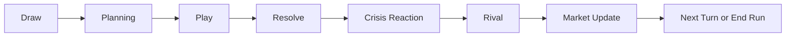
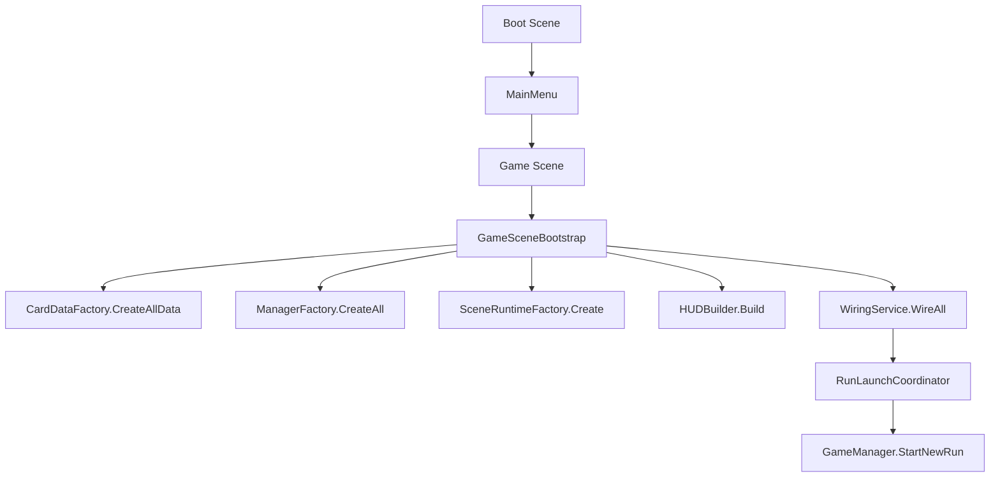
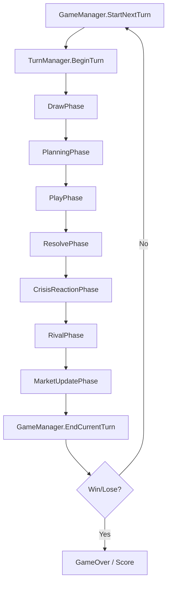

# Empire of Cards Reverse-Engineering Dossier

Repo hedefi: `/Users/omerercan/Documents/card-games-buisnes`  
Analiz tarihi: `2026-05-22`  
Analiz modu: statik repo incelemesi, runtime davranis cikarimi, ekran goruntusu destekli yorum

## Kanit Seviyeleri

| Etiket | Anlam |
|---|---|
| `Implemented in code` | Kod akisi veya veri fabrikasi icinde aktif olarak yer aliyor |
| `Partial / dormant` | Kod tabaninda var ama tam bagli degil, veya sadece kismi etkisi var |
| `GDD-only / inferred` | Dogrudan calisan runtime kaniti yok; GDD veya UI/structure yorumundan geliyor |

## Kaynak Omurga

- `Implemented in code`: `Assets/_EmpireOfCards/Scripts/Core`, `Gameplay`, `Bootstrap`, `Data`, `Save`
- `Implemented in code`: `Assets/_EmpireOfCards/Scripts/Bootstrap/Data/V4ContentFactory.cs`
- `Implemented in code`: `Assets/_EmpireOfCards/Scripts/Core/GameManager.cs`
- `Implemented in code`: `Assets/_EmpireOfCards/Scripts/Core/TurnManager.cs`
- `Implemented in code`: `Assets/_EmpireOfCards/Scripts/Gameplay/EconomyManager.cs`
- `Specified in GDD but not fully wired`: `Assets/steam-card-game-gdd/GDD.md`

---

## 1. Core Gameplay Loop Analizi

### 1.1 Yuksek Seviye Cevaplar

| Soru | Cevap | Kanit |
|---|---|---|
| Oyunda toplam kac isletme / sirket var? | Top-level venture arketipi olarak `5`: `Fast Food`, `Cafe`, `Tech App`, `Clothing Store`, `Grocery Store` | `Implemented in code` |
| Oyuncu baslangicta neyle basliyor? | Venture secimi, run name, `Tech App` icin kategori secimi; secilen venture'in `startingBusiness` karti board'a otomatik yerlestiriliyor; starter deck + neutral deck + olasi tech bonus kartlari ile run aciliyor | `Implemented in code` |
| Her tur neyi temsil ediyor? | Takvimsel mikro-zaman yerine bir `isletme karar dongusu`; toplam `25 turn = 5 season x 5 turn` | `Implemented in code` |
| Bir tur ortalama kac dakika suruyor? | Kodun zorladigi minimum sure `9.5s` no-crisis, `11.0s` crisis; gercek sure oyuncunun `PlayPhase` karar hizina bagli | `Implemented in code` |
| Tur sonunda hangi hesaplamalar yapiliyor? | Demand, capacity, quality, staff stability, legal risk, rating, gross income, tax-like expenses, net income, market share, crisis check, rival response, season/market update | `Implemented in code` |

### 1.2 Run Yapisi

- `Implemented in code`: `MAX_TURNS = 25`
- `Implemented in code`: `TURNS_PER_SEASON = 5`
- `Implemented in code`: domination check turn `6`'da aciliyor
- `Implemented in code`: shop venture bias ilk `5` tur aktif
- `Implemented in code`: event interval default `3` tur
- `Implemented in code`: rival milestone turnleri `5 / 8 / 12 / 15 / 20`
- `Partial / dormant`: `SOFT_CAP_TURN = 20` ve `SOFT_CAP_PENALTY = 0.05` tanimli, ama ekonomi formulune uygulanmiyor

### 1.3 Gercek Turn Fazlari



### 1.4 Faz Bazli Minimum Sure

| Faz | Minimum sure |
|---|---:|
| Draw | `1.0s` |
| Planning | `1.5s` |
| Play | `0s + oyuncu inputu` |
| Resolve | `3.5s` toplam step delay |
| CrisisReaction | `0.5s` no-crisis, `2.0s` crisis |
| Rival | `2.0s` |
| MarketUpdate | `1.0s` |

Toplam:

- `Implemented in code`: minimum no-crisis turn = `9.5s + player input`
- `Implemented in code`: minimum crisis turn = `11.0s + player input`

### 1.5 Tur Basinda Oyuncuya Verilen Kaynaklar

- `Implemented in code`: `3` action
- `Implemented in code`: hand size `5`
- `Implemented in code`: redraw `1`
- `Implemented in code`: turn 1 elde constrained onboarding var
- `Implemented in code`: `DrawFirstTurnHand()` en az bir `Operation` ve bir `Staff` kartini one cekiyor
- `Implemented in code`: venture opening sequence kartlari draw pile basina alinabiliyor

### 1.6 End-of-Turn Hesap Sirasi

```text
1. Board tick / production disabled check
2. Season check
3. Economy snapshot resolve
   - demand
   - capacity
   - quality
   - staff stability
   - legal risk
   - rating
   - income / expenses / net
   - market share
4. Staff tick
5. Chain reaction evaluation
6. Crisis / event trigger
7. Rival actions
8. Final market share normalization + market blocks
9. Win / lose / next turn
```

---

## 2. Milestone Turn Breakdown

Not:

- `Implemented in code`: turn `1/2/3/5` beat'leri authored
- `Implemented in code`: turn `10/20/25` icin authored beat yok
- `Inference from structure/UI/screenshot`: turn `10/20/25` yorumlari unlock thresholds, pool stage, crisis windows, rival milestones, max-turn kurali ve economy baskilarindan cikarildi

### 2.1 Fast Food

| Turn | Kaynak | Input | Decision | Consequence | Feedback loop |
|---|---|---|---|---|---|
| `1` | `Implemented in code` | Starter board + `Street Counter`, onboarding hand, 3 actions | `Extra Tables` ile floor acmak mi, yoksa staff'i oncelemek mi | Seating acilirsa demand'i absorbe edecek fiziksel alan kurulur; erken flyer itisi cezalandirilmaz | T1 resolve kapasite yetmezse overload rating'e vurur |
| `5` | `Implemented in code` | Opening beat: `ff_local_buzz`, ilk event window `3-5`, shop bias son turu | `Google Business Push` / `Flyer Team` ile mahalle talebini itmek mi, yoksa daha bir staff/cleaning katmani koymak mi | Dogru sirada growth demand getirir; erken growth review storm riskini buyutur | Demand > capacity ise turn report oyuncuya buyume tuzagini gosterir |
| `10` | `Inference from runtime thresholds` | Late pool'a gecis, event chain `10-16` reputation risk penceresi, rival aggression aktif | Review recovery / hygiene protection mi, yoksa delivery/growth skalasi mi | Midgame fast food artik "traffic engine" yerine "trust protection under volume" oyununa doner | Dusuk rating future draw bias'ta reaction kartlarini one ceker |
| `20` | `Inference from runtime thresholds` | Rival turn-20 milestone, tum slot genislemeleri teorik olarak acilmis olabilir, turn pressure yuksek | Sub-brand scale mi, margin savunmasi mi, crisis recovery mi | Endgame'de restoran zinciri hissi yerine yogun throughput savasi var; legal ve review hatalari artik fatal olabilir | Market share ve rival pressure birbirini hizlandirir; comeback sadece recovery pool ile gelir |
| `25` | `Inference from runtime thresholds` | Son turn, tiebreak money+share+survival, artik yeni engine kurma zamani gecmis | Son bir growth push mu, rating/legal savunmasi mi | Bu turn tamamen "current board'u nakde ve share'e cevir" problemine doner | Turn sonunda run biter; next-turn payoff yok, sadece anlik skor ve win/lose onemli |

### 2.2 Cafe

| Turn | Kaynak | Input | Decision | Consequence | Feedback loop |
|---|---|---|---|---|---|
| `1` | `Implemented in code` | `Espresso Bar` ile acilis, room henuz bos | `Window Seating` ile mekani yasatmak mi, `Senior Barista` ile kaliteyi one almak mi | Seating duygusal alan kurar; barista kalite ve rating tabanini kurar | Cafe'de erken rating loop'u future organic demand'e daha hizli doner |
| `5` | `Implemented in code` | `cf_regular_loop` beat, Maps/Instagram/Loyalty acilmaya hazir | Discovery mi, repeat traffic mi | Maps + loyalty secimi sosyal spike'tan daha saglam midgame acar | Weak beans veya slow service varsa event window geri tepme yaratir |
| `10` | `Inference from runtime thresholds` | `10-16` staff crack / public pressure penceresi, late pool acik | Ambience ve consistency'yi korumak mi, yoksa reels ile ekstra talep itmek mi | Cafe midgame'i demand yaratmaktan cok "regular retention without burnout" problemine doner | Staff instability dusukse pressure `StaffInstability` olur ve reaction draw bias tetiklenir |
| `20` | `Inference from runtime thresholds` | Rival high-pressure coffee war, tam market olgunlugu | Premium trust savunmasi mi, son sosyal buyume mi | Endgame cafe daha kirilgan; rating dususu local loyalty'yi hizla geri cevirir | Organic demand rating'den geldigi icin review kaybi kart ekonomisini bozar |
| `25` | `Inference from runtime thresholds` | Son evaluation turnu | Son puani rating/market share uzerinden mi, nakit uzerinden mi optimize etmek | Cafe son turda dahi trust-sensitive; riskli hamle sonraki tur olmadigi icin kisa vadeli push daha degerli olabilir | Yine de legal/rating collapse ayni anda kaybettirebilir |

### 2.3 Tech App

| Turn | Kaynak | Input | Decision | Consequence | Feedback loop |
|---|---|---|---|---|---|
| `1` | `Implemented in code` | `MVP Build` board'da, onboarding brief acikca "core'u ship et, growth alma" diyor | `Backend Upgrade` / ikinci product karti mi, growth karti mi | Growth'u erken almak crash ve low-rating riski yaratir; backend secimi trust tabanini kurar | T1 snapshot rating ve capacity'nin Tech run'da ana bozkir oldugunu gostermeye baslar |
| `5` | `Implemented in code` | `tc_growth_switch` beat, artik ASO/UA acilabilir | `ASO Push` ile kontrollu discovery mi, `Paid User Acquisition` ile agresif scale mi | Rating saglamsa scale acilir; degilse installs review borcuna doner | Demand patlamasi capacity shortfall ise scripted scale shock penceresine sokar |
| `10` | `Inference from runtime thresholds` | `10-16` trust crisis penceresi, late pool, ilk buyuk scale borcu | Privacy/trust/stability recovery mi, yoksa retention/growth engine mi | Tech midgame artik product-market fit degil "operational survivability under scale" problemidir | Low rating, high legal risk ve churn-benzeri derived metric'ler future pool bias'i degistirir |
| `20` | `Inference from runtime thresholds` | Rival turn-20 milestone, endgame acquisition savasi, sonbahar/kis sezon etkileri venture'a gore zayif | Monetization ve discovery'yi zorlamak mi, platform trust'u kapatmak mi | Buyuk user base hayali artik infra burn ve trust cezasi ile gelir | Rival pressure market share'den direkt eksiltir; comeback sadece recovery ve defensive sequencing ile olur |
| `25` | `Inference from runtime thresholds` | Son turn, artik long-tail retention getirisi yok | Son growth burst mu, trust/legal savunmasi mi | Son turda gelecek 10-turn payoff anlamsizlasir; run sonuna kadar crash etmemek daha kritik | Bankruptcy, rating collapse, legal disaster ve share kaybi ayni anda failure condition olabilir |

### 2.4 Clothing Store

| Turn | Kaynak | Input | Decision | Consequence | Feedback loop |
|---|---|---|---|---|---|
| `1` | `Implemented in code` | `Display` + `Inventory Rail` erken kimlik kurar | Vitrini mi, fit/trust omurgasini mi one almak | Gorsellik demand baslatir ama fit guveni yoksa returns ileride patlar | Quality/fit zayifsa gelecekte return pressure derived metric'i yukselir |
| `5` | `Implemented in code` | `cl_story_push` beat, collection'i artik anlatabilirsin | `Lookbook` / `Window Story` ile trend push mu, yoksa atolyeyi guclendirmek mi | Dogru zamanda marketing conversion uretir; erken yapilirsa low cash ve returns baslar | Trend traffic zayif fit yapisina carpinca rating ve margin dusurur |
| `10` | `Inference from runtime thresholds` | `10-16` margin risk penceresi | Storytelling'i surdurmek mi, stock/margin savunmasi mi | Midgame clothing "brand fantasy"den "inventory timing and return pressure" oyununa kayar | Low cash pressure kart cekisini daha savunmaci havuza iter |
| `20` | `Inference from runtime thresholds` | Rival seasonal pressure, slot genisleme potansiyeli dolmus | Son collection push mu, return damage control mu | Endgame'de yanlis stok ve gec moda hamlesi direkt skor ve share kaybidir | Seasonal venture oldugu icin pacing cliff burada daha sert hissedilir |
| `25` | `Inference from runtime thresholds` | Son turn settlement | Son discount / trend hamlesi mi, guven ve kasayi koruma mi | Gelecek sezon yok; bu yuzden gelecegi bozan ama bugunu parlatan hamleler daha kabul edilebilir | Legal/rating collapse yoksa puan paylasimi esas belirleyici olur |

### 2.5 Grocery Store

| Turn | Kaynak | Input | Decision | Consequence | Feedback loop |
|---|---|---|---|---|---|
| `1` | `Implemented in code` | `Checkout Upgrade` / shelf flow ana bottleneck | Kasa akisini mi, tazelik omurgasini mi onceleyeceksin | Checkout acilmazsa repeat traffic kitlenir; tazelik zayifsa mahalle guveni gec gelir | Grocery erken oyunda reliability-first loop oynar |
| `5` | `Implemented in code` | `gr_convenience` beat, WhatsApp / late-night acilabilir | Convenience mi, yoksa daha bir supply trust mu | Convenience sadece temel operasyon stabilse loyalty uretir | Erken convenience spoilage/checkout zayifken low rating yaratir |
| `10` | `Inference from runtime thresholds` | `10-16` neighborhood trust drop penceresi | Freshness savunmasi mi, basket-size buyumesi mi | Midgame grocery demand'den cok repeat trust ve shelf fill oyununa doner | Low rating dedikoduyu, empty shelf hissini ve rakibe kayan basket'i temsil eder |
| `20` | `Inference from runtime thresholds` | Rival market share baskisi, gece servis/fiyat savasi | Fiyat avantajina inmek mi, local loyalty'yi korumak mi | Low-margin venture oldugu icin gec oyun cash krizi daha erken hissedilir | Cash ve quality baskisi ayni anda gelirse recovery penceren daralir |
| `25` | `Inference from runtime thresholds` | Final basket war | Son convenience push mu, spoilage ve checkout savunmasi mi | Final turn'de gelecege yatirim yerine anlik sepet ve mahalle guveni puan getirir | Legal/rating sorunu yoksa final share karari run sonucunu belirler |

### 2.6 Milestone Ozetleri

| Turn | Global anlam |
|---|---|
| `1` | Venture anchor ve onboarding turnu |
| `5` | Ilk kontrollu growth switch |
| `10` | Authored beat yok; crisis-driven midgame girisi |
| `20` | Soft-cap tasarim niyeti, rival endgame escalation, tam pazar baskisi |
| `25` | Hard stop ve skor/win resolution turnu |

---

## 3. Company / Business System

Bu repo'da "company/business" ust sinifi venture'dir. Her run'da oyuncu `1` venture secer; rakip otomatik ayni venture mirror'u olur.

### 3.1 Venture Matrix

| Venture | Sektor | Starting card | Starting stats | Unlock timing | Risk seviyesi | Ozel avantaj | Zayiflik |
|---|---|---|---|---|---|---|---|
| Fast Food | Yerel hizli servis | `FF01 Street Counter` | Cash `550`, Demand `3.0`, Capacity `4.0`, Quality `3.2`, Rating `3.2`, Stability `6.5`, Share `12` | `6:+1 Marketing`, `12:+2 Operation +1 Staff`, `18:+1 Supplier +1 Staff` | Orta-yuksek | Traffic'i hizli nakde cevirir | Queue, hygiene, review spiral |
| Cafe | Mahalle kafe | `CF01 Espresso Bar` | Cash `575`, Demand `2.8`, Capacity `3.5`, Quality `3.8`, Rating `3.4`, Stability `7.0`, Share `12` | Ayni omurga | Orta | Yuksek trust ve regular loop | Staff burnout, consistency kaybi |
| Tech App | Dijital urun | `TC01 MVP Build` | Cash `520`, Demand `1.5`, Capacity `2.5`, Quality `3.0`, Rating `3.0`, Stability `6.2`, Share `12` | Ayni omurga | Yuksek | En yuksek upside ve en zengin kart havuzu | Stability, trust, infra burn |
| Clothing Store | Moda perakende | `CL01` venture starter | Cash `600`, Demand `2.4`, Capacity `3.2`, Quality `3.6`, Rating `3.1`, Stability `6.4`, Share `12` | Ayni omurga | Orta-yuksek | Display + trend conversion | Return pressure, stock timing |
| Grocery Store | Mahalle marketi | `GR01` venture starter | Cash `530`, Demand `3.4`, Capacity `4.1`, Quality `3.1`, Rating `3.3`, Stability `6.8`, Share `12` | Ayni omurga | Orta | Repeat traffic ve local loyalty | Dusuk margin, spoilage, trust drop |

### 3.2 Derived Metric Kimlikleri

| Venture | Derived metrics |
|---|---|
| Fast Food | `ingredient_quality`, `service_speed`, `hygiene` |
| Cafe | `bean_quality`, `consistency`, `ambience` |
| Tech App | `stability`, `churn`, `infra_cost` |
| Clothing Store | `stock_health`, `season_fit`, `return_pressure` |
| Grocery Store | `spoilage`, `credit_ledger`, `local_loyalty` |

### 3.3 Sirketler Birbirini Etkiliyor mu?

- `Implemented in code`: evet, ama ayni run icinde aktif top-level model `player venture vs same-venture rival`
- `Implemented in code`: pazar havuzu ortaktir; market share `0-100` clamp edilir
- `Implemented in code`: rival pressure oyuncu market share kazaniminin uzerinden negatif etki yapar
- `GDD-only / inferred`: venture'lar arasi capraz ekonomi yok; `Fast Food` ile `Cafe` ayni run'da yarismaz

### 3.4 Rekabet Sistemi

- `Implemented in code`: rival ayni venture ile baslar
- `Implemented in code`: rival action queue lane telegraph verir
- `Implemented in code`: rival milestone escalation var
- `Implemented in code`: rival pressure, player share arttikca secondary move ve aggression aciyor
- `Implemented in code`: queued-action bazli `RivalAI` modeli aktif; eski `RivalGrowth` hattı cleanup sprintinde repo'dan cikarildi

### 3.5 Sinerji Bonuslari

- `Implemented in code`: slot tipi uyumu
- `Implemented in code`: opening sequence guidance
- `Implemented in code`: supplier -> quality -> rating -> organic demand zinciri
- `Implemented in code`: staff stability -> overload penalty azaltma
- `Implemented in code`: board pressure -> future draw bias
- `Implemented in code`: solution tags -> crisis tag recovery semantigi
- `GDD-only / inferred`: klasik explicit combo matrix bu v4 runtime'da ana ekonomi omurgasindan daha ikinci planda

---

## 4. Story / Card System

### 4.1 Gercek Kart Hacmi

| Kategori | Adet | Kanit |
|---|---:|---|
| Toplam kart | `91` | `Implemented in code` |
| Fast Food | `14` venture kart + neutral baglantilari | `Implemented in code` |
| Cafe | `15` | `Implemented in code` |
| Tech App | `27` | `Implemented in code` |
| Clothing Store | `15` | `Implemented in code` |
| Grocery Store | `15` | `Implemented in code` |
| Neutral | `5` | `Implemented in code` |

### 4.2 Aile / Islev Taksonomisi

| Family | Adet | Rol |
|---|---:|---|
| `Setup` | `36` | Operation, staff, supplier, bazi stabilizer kartlari |
| `Growth` | `19` | Marketing ve demand push |
| `Risk` | `5` | Kisa vadeli spike, legal/trust borcu |
| `Reaction` | `12` | Recovery, stabilization, mitigation |
| `Crisis` | `19` | Temp-effect/event kaynakli baski |

### 4.3 Kullanilan Kart Turleri

| Tur | Repo durumu |
|---|---|
| Narrative card | `GDD-only / inferred` - explicit narrative card class yok; narrative runtime'i `TurnScriptBeat` ve tutorial mesaji tasiyor |
| Event card | `Implemented in code` - `CardType.Event`, `TurnManager.ActiveEvent`, `CrisisReactionPhase` |
| Crisis card | `Implemented in code` - `cardFamily = Crisis`, event chain ve random draw ile |
| Opportunity card | `Inference from runtime thresholds` - explicit "opportunity" family yok; growth/setup kartlari bu isi goruyor |
| Reaction card | `Implemented in code` - `cardFamily = Reaction` |
| Risk card | `Implemented in code` - `cardFamily = Risk` |

### 4.4 Trigger Pattern Tablosu

| Pattern | Tetiklenme kosulu | Kisa vadeli etkisi | Uzun vadeli etkisi | Sirket kaderine etkisi |
|---|---|---|---|---|
| Scripted crisis window | Venture event chain + turn window + pressure match | Temp effect aktif olur | Recovery draw bias'ini ve report mesajlarini degistirir | Midgame/late pacing'i venture'a ozel yapar |
| Random crisis draw | `turn % 3 == 0` veya pressure trigger | 1-2 turnluk demand/quality/risk/rating soku | Temp slot dolarsa board state'i sikistirir | Zayif board'lari daha da iter |
| Risk temp card | Oyuncu bilerek oynar | Demand spike veya kisa fayda | Legal risk / rating borcu birikir | Endgame'de fatal olabilir |
| Reaction card | Oyuncu savunma oynar | Risk veya rating hasarini azaltir | Future event-chain uyumlulugunu iyilestirir | Comeback penceresi yaratir |
| Growth card | Oyuncu talep iter | Demand ve bazen rating/visibility artar | Capacity yetmezse overload dogurur | Snowball veya self-sabotage yaratir |

### 4.5 “Bir kartin 10 tur sonraki sonucu ne?”

Repo-truth cevap:

1. Kart immediate stat deltalari snapshot'a islenir.
2. Kart `TempEffect` ise `tempEffectDuration` kadar board'da kalir.
3. Kart `crisisTags` birakiyorsa future recovery semantigini etkiler.
4. Kart rating'i dusururse organic demand zinciri zayiflar.
5. Kart legal risk arttirirsa `HighLegalRisk` pressure ve crisis trigger sansi buyur.
6. Board pressure gelecekte cekilecek kart havuzunu bias'lar.
7. Venture event chain ayni baski tipinde yeni scripted event acabilir.
8. Save/load runtime state bu zinciri korur.

Yani bu oyunda "10 turn sonraki sonuc" cogu zaman tek bir delayed callback degil; asagidaki bileşik etkidir:

```text
card play
-> snapshot deltalari
-> pressure degisimi
-> draw bias degisimi
-> event window uyumu
-> rival pressureye karsi zayiflik veya guc
-> market share trendi
```

### 4.6 Hidden Modifiers

| Modifier | Durum | Not |
|---|---|---|
| Organic demand from rating | `Implemented in code` | `max(0, rating - 3) * ratingToOrganicDemandWeight` |
| Overload penalty | `Implemented in code` | `demand - capacity` rating'e negatif yansiyor |
| Legal risk natural decay | `Implemented in code` | profile `legalRiskDecayPerTurn` |
| Season multiplier | `Implemented in code` | venture-specific season multiplier |
| Rival pressure subtraction | `Implemented in code` | market share kazanimindan dusuyor |
| Shop bias | `Implemented in code` | ilk 5 tur venture-tag bias |
| Scripted event windows | `Implemented in code` | venture event chain |
| Save/restore runtime state | `Implemented in code` | runtime/opening/event chain state kaydediliyor |
| Soft cap income penalty | `Partial / dormant` | constant var, resolve formulunde yok |
| Inflation pressure | `Partial / dormant` | class var, runtime wiring yok |

---

## 5. Dynamic Economy System

### 5.1 Gercek Snapshot Formulleri

```text
demand =
  baseDemand
  + operation demand contribution
  + marketing demand contribution
  + organic demand from rating
  + temp demand contribution
  + tech category modifier

capacity =
  startingCapacity
  + tech category capacity modifier
  + operation capacityDelta
  + staff capacityDelta
  + supplier capacityDelta
  + temp capacityDelta

quality =
  clamp(
    startingQuality
    + tech category quality modifier
    + operation qualityDelta
    + staff qualityDelta
    + supplier qualityDelta
    + temp qualityDelta
  )

staffStability =
  clamp(
    startingStaffStability
    + staff stabilityDelta
    + temp stabilityDelta
    - max(0, marketingCount - staffCount) * 0.4
  )

legalRisk =
  clamp(
    previousLegalRisk
    - legalRiskDecayPerTurn
    + tech category legal risk modifier
    + supplier legalRiskDeltaPerTurn
    + marketing legalRiskDeltaPerTurn
    + temp legalRiskDeltaPerTurn
    + subsystem effects
  )

ratingDelta =
  ((quality - 5) * qualityToRatingWeight)
  - (overload * capacityPenaltyMultiplier)
  - max(0, 4 - staffStability) * staffInstabilityPenalty
  + tech category rating modifier
  + marketing ratingDeltaPerTurn
  + temp ratingDeltaPerTurn

grossIncome =
  servedDemand * baseRevenuePerDemand
  + all card cashDeltaPerTurn

netIncome =
  grossIncome
  - salaries
  - upkeep
  - tax
  - subsystemExpenses

marketShare =
  clamp(
    previousMarketShare
    + ((rating - 3) * 2)
    + ((quality - 5) * 1.5)
    + (servedDemand - overload) * 0.5
    - (rivalPressureImpact * 1.15)
  )
```

### 5.2 Demand / Growth / Risk / Market Kisa Cevaplari

| Baslik | Repo formu |
|---|---|
| `profit` | Pratikte `netIncome` |
| `growth` | Ayrik tek form yok; demand push + rating + market share kazanimi bileşimi |
| `risk` | Asil runtime risk metrigi `legalRisk` + `rating collapse` + `cash crisis` |
| `market` | `marketShare` 0-100 snapshot + rival normalization |

### 5.3 Inflation, Fluctuation, Scripted Event, Rubberbanding

| Sistem | Durum | Yorum |
|---|---|---|
| Inflation | `Partial / dormant` | Class ve event var; aktif runtime loop'ta instantiate edilmiyor |
| Random market fluctuation | `Partial / dormant` | Genel bir price curve yok; random event draw ve rival variation var |
| Scripted event | `Implemented in code` | Venture event windows bunu yapiyor |
| Rubberbanding | `Partial / inferred` | Rival pacing slowed yorumlari, recovery pools ve defensive draw bias var; saf hard-rubberband yok |
| Difficulty scaling | `Implemented in code` | Rival milestones, event windows, seasons, market maturation, max-turn clock |

### 5.4 Economy Alt Sistem Audit

| Alt sistem | Durum | Not |
|---|---|---|
| SalarySystem | `Implemented in code` | EconomyManager icinde etkileri var, UI decision akisi sinirli |
| CreditSystem | `Implemented in code` | Interest tick expense'e ekleniyor |
| InsuranceSystem | `Implemented in code` | Staff count uzerinden legal risk bindiriyor |
| StockSystem | `Implemented in code` | Kalite/venture bagli penaltiler var |
| TaxPeriodSystem | `Implemented in code` | Profit period accumulation ve unpaid tax risk mevcut |
| MarketPool | `Removed` | Legacy customer-pool yaklasimi cleanup sprintinde kaldirildi |
| InflationSystem | `Removed` | Aktif resolve akisina bagli olmayan dormant sinif repo'dan cikarildi |

### 5.5 Difficulty Scaling Gercekligi

- `Implemented in code`: turn `3/6/9/12...` civari event / pressure yakalama
- `Implemented in code`: rival escalation `5/8/12/15/20`
- `Implemented in code`: unlock thresholds `6/12/18`
- `Implemented in code`: season multipliers venture'a gore farkli
- `Partial / dormant`: turn `20` soft-cap niyeti var ama income penalty aktif degil
- `Implemented in code`: hard stop `25` turn

---

## 6. Code Architecture Reverse Engineering

### 6.1 Ana Sinif Haritasi

| Class | Rol | Durum |
|---|---|---|
| `GameManager` | Run state, turn progression, win/lose, manager registry | `Implemented in code` |
| `TurnManager` | Faz state machine | `Implemented in code` |
| `EconomyManager` | Snapshot economy resolve ve report/brief generation | `Implemented in code` |
| `DeckManager` | Draw/hand/discard/opening sequencing | `Implemented in code` |
| `BoardManager` | Board placement, temp effects, active business state | `Implemented in code` |
| `RivalAI` | Rival queued actions ve pressure | `Implemented in code` |
| `ShopManager` | Turnluk 3 kartlik offer ve buy flow | `Implemented in code` |
| `SaveManager` | Meta save + run checkpoint | `Implemented in code` |
| `SlotManager` | 5 slot family occupancy ve expansion | `Implemented in code` |
| `StaffStateSystem` | Morale/fatigue/loyalty/xp | `Implemented in code` |
| `ChainReactionSystem` | Deterministic crisis counters | `Implemented in code` |
| `IVentureRuntime` | Venture-specific playbook runtime | `Implemented in code` |

### 6.2 Boot / Runtime Factory Akisi



### 6.3 Turn / Event Akisi



### 6.4 Mimari Karakter

- `Implemented in code`: event-driven
- `Implemented in code`: state machine var
- `Implemented in code`: ScriptableObject-driven content var
- `Implemented in code`: runtime factory / bootstrap pattern var
- `Implemented in code`: save-state surfaces venture runtime state'i de kapsiyor
- `Partial / dormant`: legacy business/territory modellerinin izi hala kodda duruyor

### 6.5 EventBus Omurgasi

EventBus su domainleri tasiyor:

- card events
- board events
- world events
- legal risk
- platform rating
- cash flow
- season
- customer market
- turn brief / turn report
- economy choices
- rival preview ve taunt
- staff state
- chain reactions

Bu, projeyi gercekten event-driven yapan ana parca.

---

## 7. Scene Structure

### 7.1 Build Scene Stack

| Scene | Build'de mi? | Rol |
|---|---|---|
| `Boot.unity` | Evet | next-scene dispatch |
| `MainMenu.unity` | Evet | save list ve run girisi |
| `Game.unity` | Evet | runtime-built gameplay |
| `LegacyGameScene.unity` | Hayir | legacy / experiment scene |

### 7.2 Gameplay Scene Gercek Yapisi

`Game.unity` statik prefab yuvasi degil; runtime'da asagidaki buyuk katmanlar yaratiliyor:

- `Main Camera`
- `Board3D`
- `CardFactory`
- `Hand3D`
- post-processing / lights / VFX roots
- `HUDCanvas`
- `UIManager`
- `TutorialUI`
- venture selection UI
- run name / category prompt

### 7.3 Hierarchy Modeli

```text
Scene roots
├── [GameBootstrap]
├── Main Camera
├── Board3D runtime root
├── Hand runtime root
├── CardFactory
├── Lighting / Volume / VFX roots
└── HUDCanvas
    ├── TopBar
    ├── Market bar
    ├── Action bar
    ├── Popups / reports / shop
    ├── Tutorial overlay
    └── Run setup overlays
```

### 7.4 Prefab Gercegi

- `Partial / inferred`: proje prefab kullanabiliyor ama ana gameplay layout'u prefab-centric degil
- `Implemented in code`: board, hand, HUD, camera, tutorial ve prompt'lar runtime builders ile kuruluyor

---

## 8. Balancing System

### 8.1 Snowball Oluyor mu?

Evet, ama kontrollu.

Snowball vektorleri:

- `Implemented in code`: rating -> organic demand
- `Implemented in code`: demand absorbe edildikce market share artis
- `Implemented in code`: early correct sequencing future draw bias ve event survival'i kolaylastiriyor

Counterweights:

- `Implemented in code`: overload rating'i cezalandiriyor
- `Implemented in code`: legal risk ve crisis windows growth'u geri itiyor
- `Implemented in code`: rival pressure market share kazancini kesiyor

### 8.2 Comeback Mechanic var mi?

- `Implemented in code`: reaction/recovery havuzlari
- `Implemented in code`: board pressure based draw bias
- `Implemented in code`: rival pacing comments "slowed to give comeback window"
- `Partial / inferred`: bu tam rubberband degil; daha cok savunma cevabi icin kaynak verme modeli

### 8.3 Oyuncu nasil kaybediyor?

- `Implemented in code`: para `<= 0`
- `Implemented in code`: rival share domination
- `Implemented in code`: rating `<= 1.0` durumunun 3 ardışık turn surmesi
- `Implemented in code`: legal risk `>= 90`
- `Implemented in code`: turn `25` sonunda share karsilastirmasi kaybetmek

### 8.4 Oyuncu nasil kazaniyor?

- `Implemented in code`: domination aktif olduktan sonra `60+` market share
- `Implemented in code`: turn `25` sonu player share >= rival share ise win

### 8.5 Pacing Cliffs

| Cliff | Durum |
|---|---|
| Turn 5 | Ilk buyume baskisi |
| Turn 6 | Ilk slot unlock + domination aktif |
| Turn 10 | Event chain late crisis bandi baslar |
| Turn 12 | Buyuk slot unlock |
| Turn 20 | Endgame pressure hissi yuksek, soft-cap niyeti var |
| Turn 25 | Hard end |

---

## 9. Hidden Design Patterns

| Pattern | Bulgular | Durum |
|---|---|---|
| Dopamine loop | Opening hand guidance -> visible board prop unlock -> turn brief -> turn report -> rival telegraph -> next answer | `Implemented in code` |
| Loss aversion | Rating/legal risk dususu ve crisis threat'leri oyuncuyu savunma kartlarina iter | `Implemented in code` |
| Forced scarcity | Action cap, slot cap, temp-effect cap, shop size limit | `Implemented in code` |
| Fake choice | Tam fake degil; ama erken growth kartlari teorik secim olup pratikte cezalandirilabilir | `Inference from runtime thresholds` |
| Delayed reward | Backend/staff/supplier yatirimlari 1-3 turn sonra scale eder | `Implemented in code` |
| Tension curve | Turn 1 onboarding -> turn 5 growth -> turn 10 crisis band -> turn 20 endgame pressure -> turn 25 final | `Implemented in code` |

### 9.1 Tasarim Hilesi Degil, Tasarim Omurgasi Olan Pattern'ler

- "grow only after reliability" prensibi
- "kart oyunu gibi gorunup aslinda sequencing simulator" yapisi
- rakibin hamlesini tam saklamayip lane olarak gostermek
- turn brief ile designer-intent'i oyuncuya acik yazmak

---

## 10. Rebuild Blueprint

### 10.1 Sifirdan Gelistirme Sirasi

1. Core turn state machine
2. Slot family model ve board occupancy
3. Venture ScriptableObject profilleri
4. Card runtime modeli ve placement kurallari
5. Economy snapshot resolve
6. Rival pressure ve market share modeli
7. Crisis / event chain sistemi
8. HUD, tutorial, turn brief/report
9. Save/load checkpoint modeli
10. Balance pass, content expansion, polish

### 10.2 Sprint Plani

| Sprint | Hedef |
|---|---|
| Sprint 1 | `core loop`, `state machine`, `turn phases`, `event bus` |
| Sprint 2 | `slot system`, `board runtime`, `card placement`, `opening hand` |
| Sprint 3 | `venture profiles`, `deck profiles`, `economy profiles`, `content factory` |
| Sprint 4 | `economy resolve`, `rating/legal risk`, `market share`, `turn report` |
| Sprint 5 | `rival AI`, `rival pressure`, `milestones`, `shared market war` |
| Sprint 6 | `crisis windows`, `reaction/risk loop`, `chain reaction system` |
| Sprint 7 | `shop`, `tutorial`, `HUD`, `clarity panels`, `scene bootstrap` |
| Sprint 8 | `save/load`, `balance audit`, `content tuning`, `juice/polish` |

### 10.3 MVP vs Secondary

| Katman | Oncelik |
|---|---|
| Turn loop, slots, economy snapshot, rival pressure, crisis windows | `MVP zorunlu` |
| Staff xp/loyalty derinligi, credit/tax/insurance UX, inflation | `Secondary` |
| Legacy market pool/territory kalintilari | `Refactor / cleanup` |

---

## Risk Analysis

### Uygulama Riskleri

1. `Partial / dormant`: ekonomi alt sistemleri ile ana snapshot resolve arasinda ikinci bir complexity katmani var; bunlar UI karar akislariyla tam eslenmezse sistem hissedilmez.
2. `Partial / dormant`: `SOFT_CAP` ve `Inflation` gibi tanimli ama bagli olmayan mekanikler designer-intent ile runtime gercegi arasinda kayma yaratiyor.
3. `Implemented in code`: Tech App kart havuzu diger venture'lardan belirgin buyuk; content parity bozulabilir.
4. `Partial / legacy-adjacent`: eski business/territory model kalintilari v4 venture runtime ile ileride carpisabilir.
5. `Implemented in code`: gameplay test coverage cok dusuk; mevcut edit mode testleri mimari genisligi korumuyor.

### Design Riskleri

1. Ilk 5 tur guidance cok guclu; replayability ile authored-path hissi arasinda gerilim var.
2. Midgame ve endgame authored beat yerine threshold inference'e dayaniyor; bu iyi balanslanmazsa turn `10+` daha generik hissedebilir.
3. Recovery havuzu var ama tam comeback rubberband yok; oyuncu hata yaptiginda "geri donus var ama bagislanma yok" tasarimi hissedilir.

---

## Son Hukum

Bu proje bir "kartlarla is simi" prototipinden ileri gitmis durumda. Mevcut runtime omurga su kimlige sahip:

- `Implemented in code`: venture-first
- `Implemented in code`: same-market rival war
- `Implemented in code`: pressure-driven economy snapshot
- `Implemented in code`: scripted opening guidance + reactive midgame crisis
- `Partial / dormant`: bazi ekonomi alt sistemleri ve soft-cap/inflation gibi gec oyun baskilari tam bagli degil

Eger bu oyun sifirdan rebuild edilecekse, asil korunmasi gereken sey tek tek kart adlari degil; su zincirdir:

```text
board sequencing
-> pressure creation
-> trust / risk reaction
-> shared market war
-> clarity-rich turn feedback
```

Bu zincir korunursa Empire of Cards tekrar insa edilebilir. Bu zincir kaybolursa geriye sadece kartli bir dashboard kalir.
